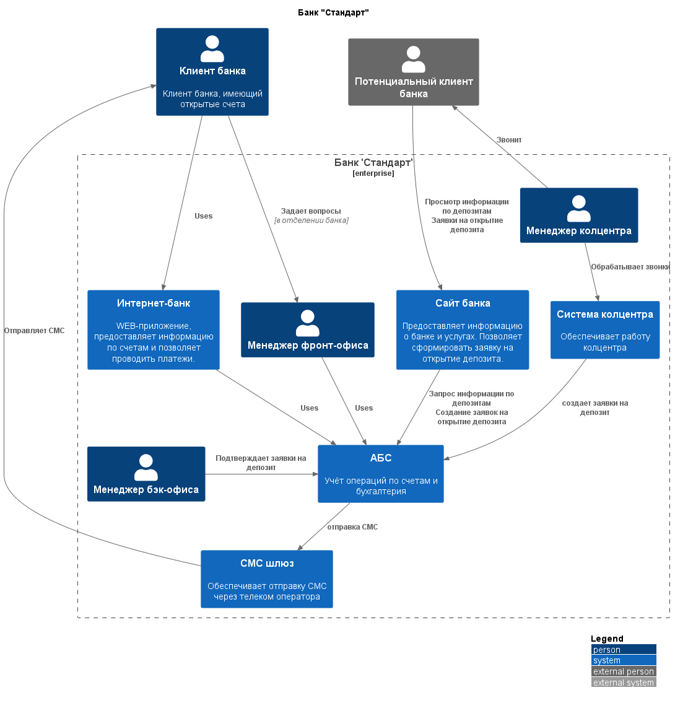
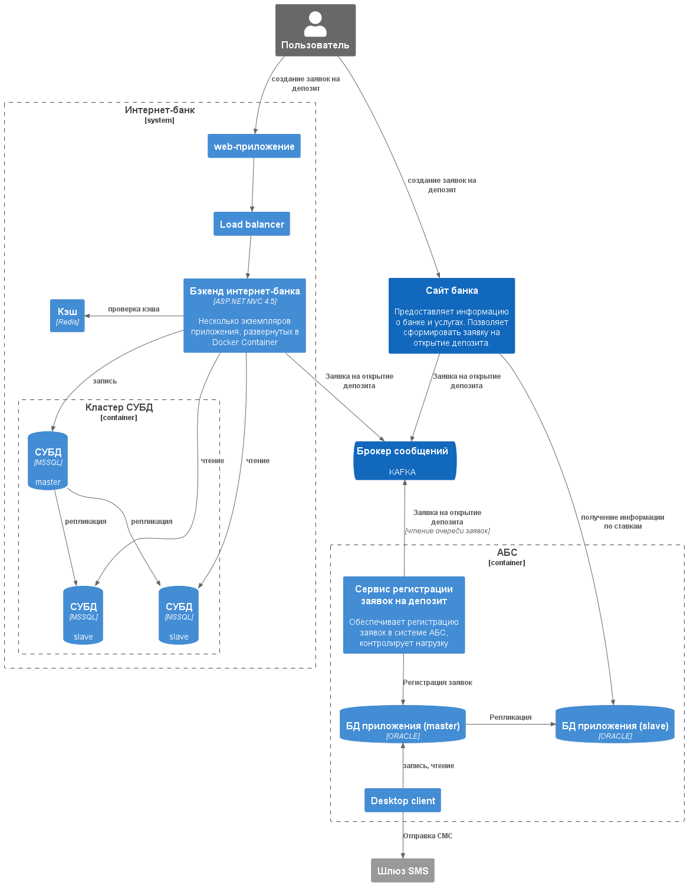

### **Название задачи:** 
### **Автор:**
### **Дата:**
### **Функциональные требования**
Опишите здесь верхнеуровневые Use Cases. Их нужно оформить в виде таблицы с пошаговым описанием:

<table><tbody><tr><th>
№
</th><th>
Действующее лицо или система
</th><th>
Use Case
</th><th>
Описание
</th></tr><tr><td>
UC1
</td><td>
Клиент банка, сайт, менеджер КЦ, менеджер бэкофиса, система КЦ, АБС, СМС шлюз 
</td><td>
Открытие депозита через сайт
</td><td><ol><li>Клиент видит на сайте список предложений по депозитам</li><li>Пользователь нажимает кнопку Открыть депозит рядом с предложением, вводит номер телефона, ФИО и нажимает кнопку Отправить</li><li>Данные заявки отправляются на сервер, на сервере создается заявка в системе колцентра</li><li>Менеджер колцентра видит заявку в своей системе, звонит клиенту, они согласуют условия</li><li>Система колцентра создает заявку на депозит в АБС</li><li>Клиент приходит в отделение банка и подтверждает свою личность</li><li>Менеджер бэкофиса подтверждает условия и открывает депозит</li><li>АБС отправляет на шлюз СМС команду об отправке клиенту СМС об открытии депозита</li></ol></td></tr><tr><td>
UC2
</td><td>
Клиент банка, интернет-банк, менеджер бэкофиса, АБС, СМС шлюз
</td><td>Открытие депозита через интернет-банк</td><td><ol><li>Клиент видит в приложении интернет-банка персональные условия по депозитам</li><li>Клиент нажимает кнопку Открыть депозит, указывает счет, с которого пополнить депозит, сумму и нажимает кнопку Отправить</li><li>Данные по заявке отправляются на бэкенд интернет-банка, где бэкенд создает заявку на депозит в АБС</li><li>Менеджер бэкофиса подтверждает условия и открывает депозит</li><li>АБС отправляет на шлюз СМС команду об отправке клиенту СМС об открытии депозита</li></ol></td></tr><tr><td></td><td></td><td></td><td></td></tr></tbody></table>

### **Нефункциональные требования**
|**№**|**Требование**|
| :-: | :- |
| +R1  | Трафик между интернет-банком и бэкендом должен шифроваться|
| +R1  | Трафик между сайтом и бэкендом должен шифроваться|
| +R2  | Хранение персональных ставок должно быть перенесено в АБС|
| +R2  | Для открытия депозита через сайт клиент должен лично придти в отделение для подтверждения личности|
| +R3  | Доработка функционала работы с СМС должна выполняться внутренними ресурсами без привлечения подрядчиков|
| +R3  | Для базы данных АБС должна быть настроена репликация в slave-базу. Все запросы справочной неоперативной информации должны быть направлены на реплику|
| +R4  | Бэкенд интернет-банка должен взаимодействовать с API АБС через KAFKA|
| +R5  | Бэкенд интернет-банка должен поддерживать горизонтальное масштабирование |
| +R4  | На бэкенде интернет-банка должен быть настроен файерволл и балансировщик нагрузки для защиты от атак |
| +R4  | На бэкенде сайта должен быть настроен файерволл и балансировщик нагрузки для защиты от атак |

### **Решение**

Во всех случаях разделяем БД на БД для записи и БД для чтения.
Для того, чтобы не загрузить основную базу АБС, выполняем асинхронную запись новых заявок.

### **Альтернативы**
-

**Недостатки, ограничения, риски**
Приложение интернет-банка масштабируется горизонтально только на уровне приложения.
На уровне СУБД MSSQL не поддерживает шардирование и его надо делать искусчственно.
