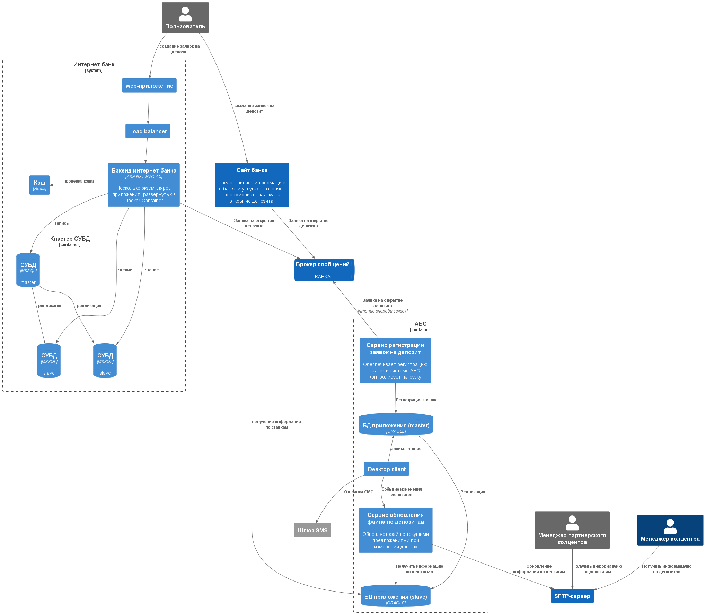

### **Название задачи:** 
### **Автор:**
### **Дата:**
### **Функциональные требования**
Опишите здесь верхнеуровневые Use Cases. Их нужно оформить в виде таблицы с пошаговым описанием:

<table><tbody><tr><th>
№
</th><th>
Действующее лицо или система
</th><th>
Use Case
</th><th>
Описание
</th></tr><tr><td>
UC1
</td><td>
менеджер КЦ
</td><td></td><td><ol><li>Менеджер колцентра имеет доступ к файлу по депозитам</li></ol></td></tr><tr><td>
UC2
</td><td>
Менеджер партнерского КЦ
</td><td></td><td><ol><li>Менеджер партнерского колцентра заходит по определенному URL и получает файл с актуальными данными по депозитам</li></ol></td></tr><tr><td></td><td></td><td></td><td></td></tr></tbody></table>

### **Нефункциональные требования**
|**№**|**Требование**|
| :-: | :- |
| +R1  | Трафик должен шифроваться|
| +R1  | Доступ к файлу должен быть по индивидуальному токену|

### **Решение**

### **Альтернативы**
-

**Недостатки, ограничения, риски**
- Я не знаю, как обеспечить токен для партнерского колцентра для доступа к SFTP
- Файловое хранилище - не самое лучшее решение

